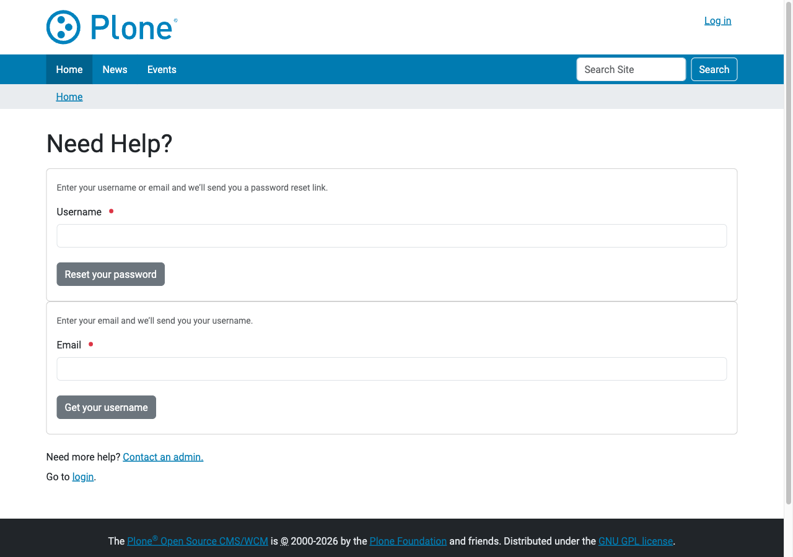
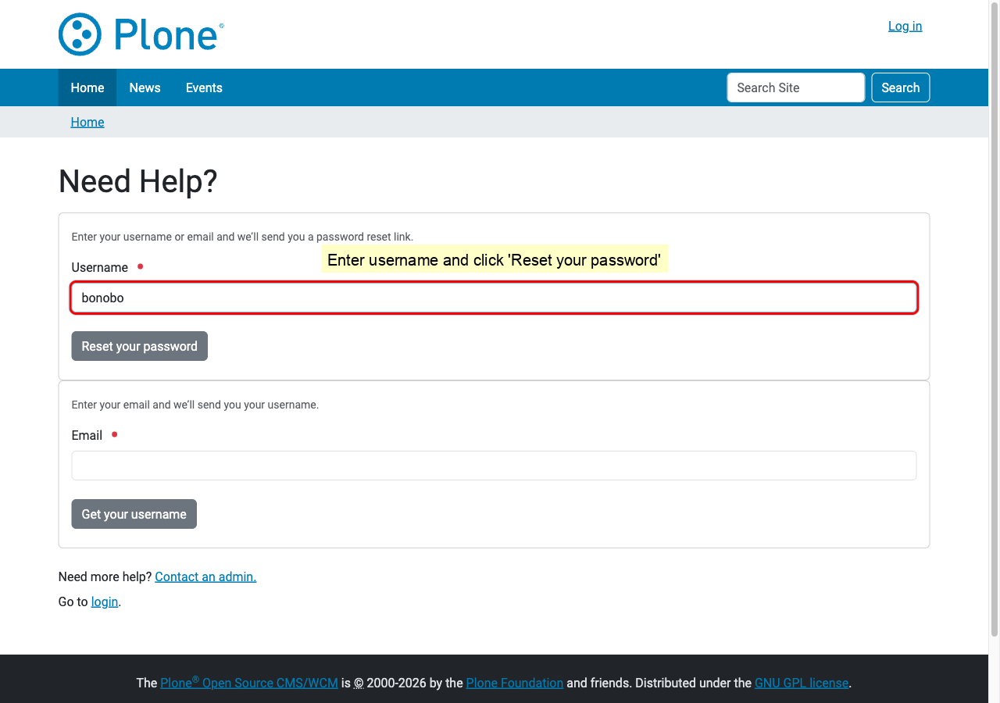
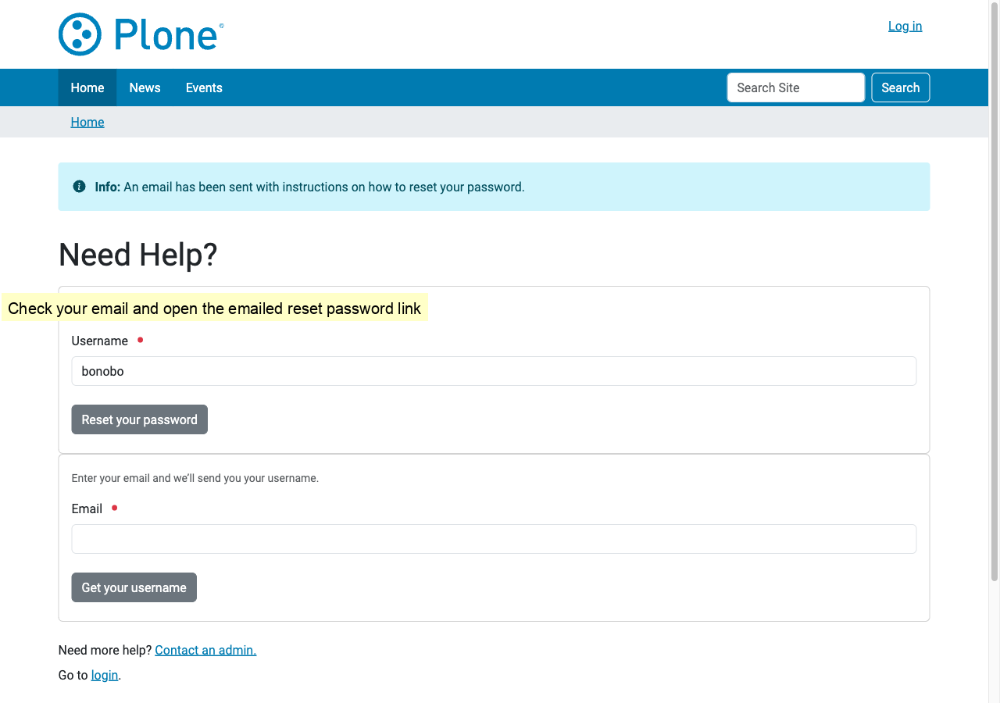
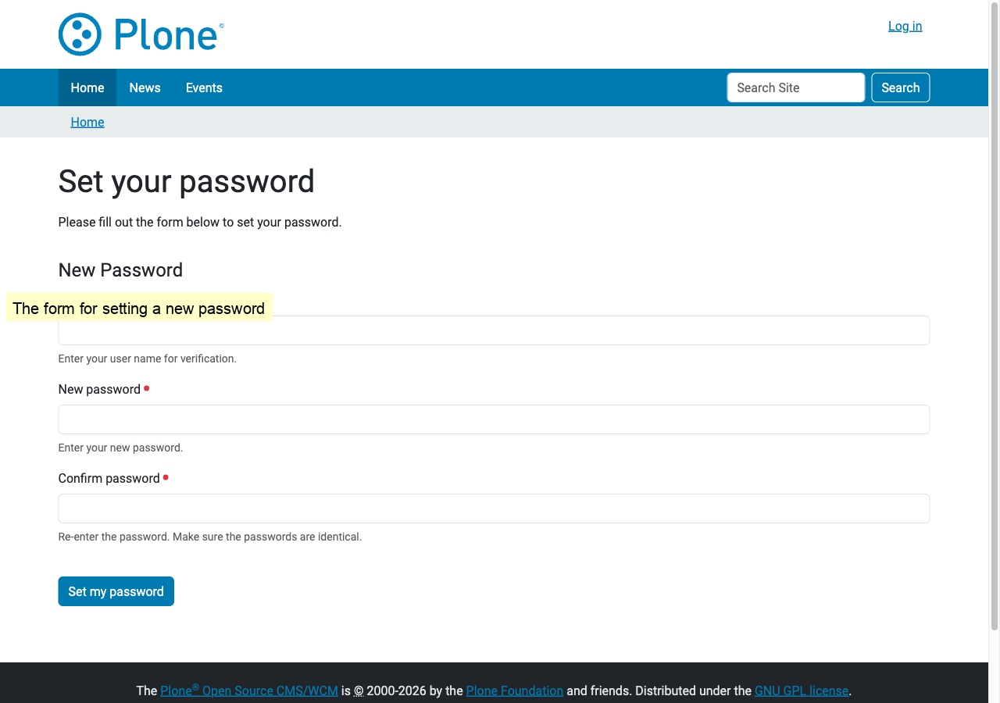
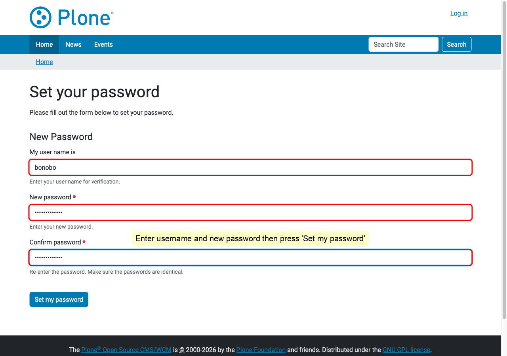
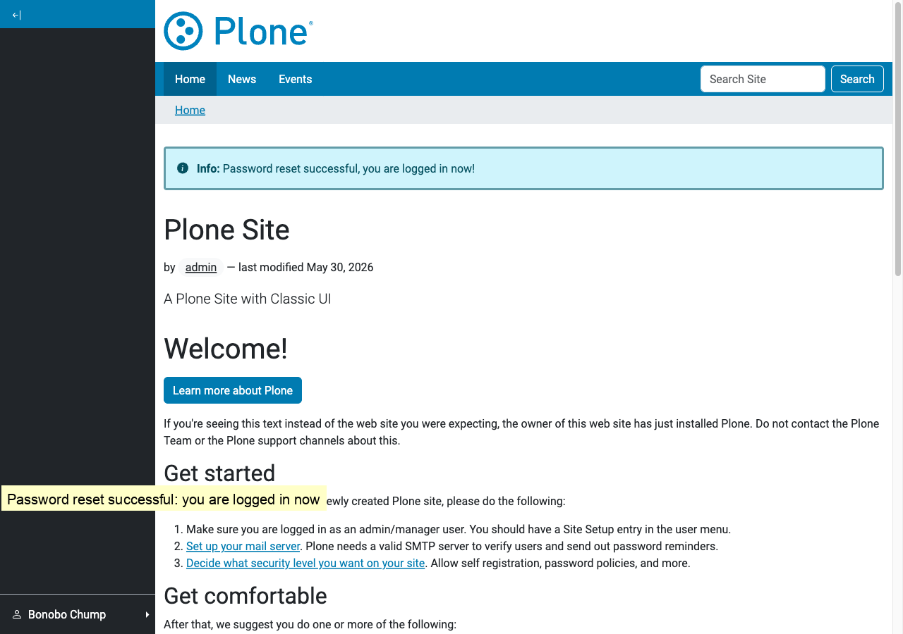

## Step 1: Open http://localhost:8080/Plone and click 'Log in'

## Step 2: Click 'Get help'

## Step 3: The reset password page

## Step 4: Enter username and click 'Reset your password'

## Step 5: Check your email and open the emailed reset password link

## Step 6: The form for setting a new password

## Step 7: Enter username and new password then press 'Set my password'

## Step 8: Password reset successful: you are logged in now

